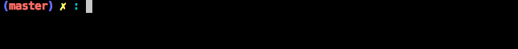

# CLI ProgressBar

A basic progress bar for usage in CLI scripts. It provides the following information:

- Progress Bar
- Percentage
- Current Iteration / Total Iterations
- Estimated Time
- Memory Usage

---

## Example

The output will look somewhat like this:

## Installation

Installation is done simply using Composer:

    composer require kanduvisla/cli-progressbar

## Usage

    use Kanduvisla\ProgressBar;
    ProgressBar::show($currentIteration, $totalIterations);
    
See `examples/basic.php` for a simple example.
